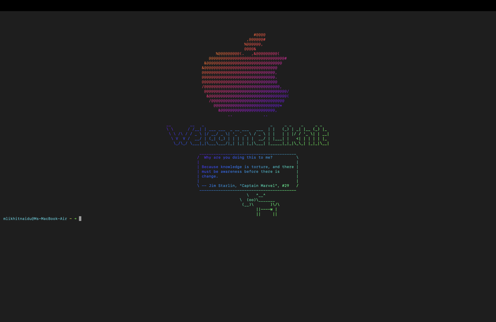

# 🍎 Royal macOS Terminal Setup

A fully customized macOS terminal startup experience featuring:

- Centered Apple ASCII logo
- Dynamic Figlet welcome banner
- Random quote on every new tab
- Cowsay-formatted quote
- Gradient coloring via lolcat
- ANSI-safe centering (no broken ASCII)
- Clean minimal zsh prompt

Built specifically for macOS (zsh).

---

# 📸 Preview




---

# ✨ Features

## 🎨 Visual Design
- Apple ASCII logo
- Rainbow gradient output
- Fully centered content
- Dynamic width detection
- Resize-safe layout

## 💬 Smart Greeting System
- Large figlet banner
- Random short quote (`fortune -s`)
- Cowsay formatting
- Clean minimal prompt styling

## ⚙️ Technical Highlights
- Uses `tput cols` to detect terminal width
- Strips ANSI escape codes before measuring length
- Calculates dynamic horizontal padding
- Applies color AFTER centering
- No hardcoded spacing

---

# 🛠 Requirements

## 1️⃣ Install Homebrew (if not installed)

```bash
/bin/bash -c "$(curl -fsSL https://raw.githubusercontent.com/Homebrew/install/HEAD/install.sh)"
2️⃣ Install Dependencies
brew install figlet fortune cowsay lolcat

📁 Project Structure
.
├── README.md
├── setup.sh
├── .apple_logo
├── .center
└── preview.png

🚀 Manual Installation
Step 1 — Create Apple ASCII Logo
nano ~/.apple_logo


Paste your Apple ASCII art.

Make sure:

No empty lines at the top

First character starts on line 1

Save and exit.

Step 2 — Create ANSI-Safe Centering Script
nano ~/.center


Paste:

#!/bin/bash

cols=$(tput cols)

strip_ansi() {
  sed -E 's/\x1B\[[0-9;]*[mK]//g'
}

while IFS= read -r line; do
  clean=$(echo "$line" | strip_ansi)
  len=${#clean}

  if [ $len -lt $cols ]; then
    pad=$(( (cols - len) / 2 ))
    printf "%*s%s\n" $pad "" "$line"
  else
    echo "$line"
  fi
done


Make executable:

chmod +x ~/.center

Step 3 — Update .zshrc

Open:

nano ~/.zshrc


Add this at the bottom:

clear

cat ~/.apple_logo | ~/.center | lolcat
figlet "Likhit" | ~/.center | lolcat
fortune -s | cowsay | ~/.center | lolcat

export PS1="%F{cyan}%n@%m %F{yellow}%~ %F{green}➜ %f"


Reload:

source ~/.zshrc


Restart Terminal.

⚡ Automatic Installation (setup.sh)

Create:

nano setup.sh


Paste:

#!/bin/bash

echo "Installing dependencies..."
brew install figlet fortune cowsay lolcat

echo "Creating Apple logo..."
cat > ~/.apple_logo <<'EOF'
                                                                            
                                                                                                          #@@@@                                
                                                                                                       ,@@@@@@#                                
                                                                                                      %@@@@@@,                                 
                                                                                                      @@@@&                                    
                                                                                          %@@@@@@@@@(.   ,&@@@@@@@@@(                          
                                                                                       @@@@@@@@@@@@@@@@@@@@@@@@@@@@@@@@#                       
                                                                                     &@@@@@@@@@@@@@@@@@@@@@@@@@@@@@@@@                         
                                                                                    &@@@@@@@@@@@@@@@@@@@@@@@@@@@@@@@                           
                                                                                    @@@@@@@@@@@@@@@@@@@@@@@@@@@@@@@,                           
                                                                                    @@@@@@@@@@@@@@@@@@@@@@@@@@@@@@@.                           
                                                                                    @@@@@@@@@@@@@@@@@@@@@@@@@@@@@@@@                           
                                                                                    /@@@@@@@@@@@@@@@@@@@@@@@@@@@@@@@@,                         
                                                                                     @@@@@@@@@@@@@@@@@@@@@@@@@@@@@@@@@@@/                      
                                                                                      &@@@@@@@@@@@@@@@@@@@@@@@@@@@@@@@@@(                      
                                                                                       /@@@@@@@@@@@@@@@@@@@@@@@@@@@@@@@                        
                                                                                         @@@@@@@@@@@@@@@@@@@@@@@@@@@@*                         
                                                                                           &@@@@@@@@@@@@@@@@@@@@@@@,                           
                                                                                               ..             ..        
EOF

echo "Creating center script..."
cat > ~/.center <<'EOF'
#!/bin/bash
cols=$(tput cols)

strip_ansi() {
  sed -E 's/\x1B\[[0-9;]*[mK]//g'
}

while IFS= read -r line; do
  clean=$(echo "$line" | strip_ansi)
  len=${#clean}

  if [ $len -lt $cols ]; then
    pad=$(( (cols - len) / 2 ))
    printf "%*s%s\n" $pad "" "$line"
  else
    echo "$line"
  fi
done
EOF

chmod +x ~/.center

echo "Updating .zshrc..."
cat >> ~/.zshrc <<'EOF'

clear
cat ~/.apple_logo | ~/.center | lolcat
figlet "Likhit" | ~/.center | lolcat
fortune -s | cowsay | ~/.center | lolcat
export PS1="%F{cyan}%n@%m %F{yellow}%~ %F{green}➜ %f"
EOF

echo "Installation complete."
echo "Restart Terminal."


Make executable:

chmod +x setup.sh


Run:

./setup.sh

🧠 How It Works

tput cols detects terminal width

ANSI escape sequences are stripped

Line length is measured correctly

Padding is computed dynamically

ASCII is centered

Color is applied afterward

Prompt loads cleanly

🧩 Customization

Change banner text:

figlet "YourName"


Change prompt colors:

export PS1="%F{red}%n@%m %F{blue}%~ ➜ %f"


Use different figlet font:

figlet -f slant "Likhit"

⚠️ Troubleshooting
Cow looks broken?

Make sure color (lolcat) is applied AFTER centering.

Large vertical gap?

Remove extra echo lines.
Ensure no empty lines in .apple_logo.

“Last login” message?

To disable:

touch ~/.hushlogin


To undo:

rm ~/.hushlogin

